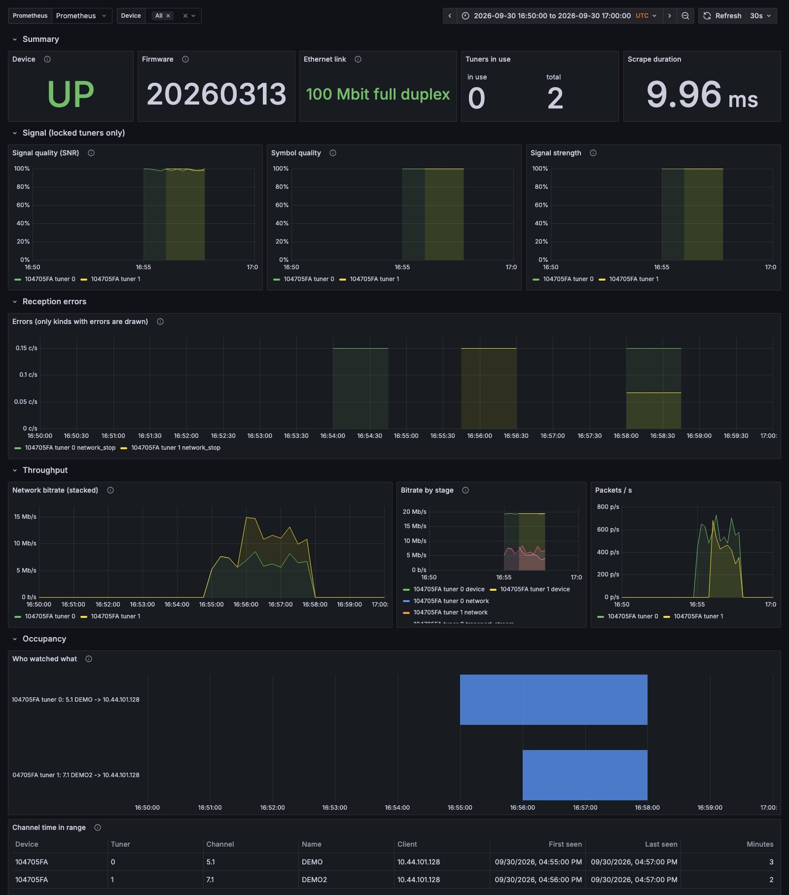

# hdhomerun-exporter

A Prometheus exporter for [SiliconDust HDHomeRun](https://www.silicondust.com/) network TV tuners, with an example Grafana dashboard.

It reads each tuner over the device's own TCP control protocol (the interface `hdhomerun_config` uses). That covers signal, reception errors, bitrates, and who is watching which channel. The error counters are only exposed there; the HTTP JSON API doesn't have them.



## Run it

```bash
docker run -d --name hdhomerun-exporter -p 9137:9137 \
  -e HDHOMERUN_TARGETS=192.168.1.50 \
  ghcr.io/jrytio/hdhomerun-exporter:latest
```

Replace `192.168.1.50` with your tuner's IP (shown in the HDHomeRun app, or at `http://<tuner>/discover.json`). Check it with `curl localhost:9137/metrics`.

The image is multi-arch (amd64 and arm64), so it also runs on a Raspberry Pi.

## Scrape it

```yaml
# prometheus.yml
scrape_configs:
  - job_name: hdhomerun
    static_configs:
      - targets: ["hdhomerun-exporter:9137"]
```

## Dashboard

In Grafana, go to **Dashboards → New → Import** and upload [`dashboards/hdhomerun.json`](dashboards/hdhomerun.json). Pick your Prometheus datasource when prompted.

## Configuration

| Env | Default | |
|---|---|---|
| `HDHOMERUN_TARGETS` | required | Comma-separated `ip[:port][=name]`, e.g. `192.168.1.50=living-room,192.168.1.51=den`. `name` becomes the `device_id` label and defaults to the IP. |
| `LISTEN_PORT` | `9137` | |
| `TIMEOUT_SECONDS` | `3` | Time budget for reading one device |
| `CACHE_SECONDS` | `1` | Reuse a device read for this long. Concurrent requests always share one read. |

Targets must be IP addresses; hostnames aren't accepted. Bad settings stop the exporter at startup with a message saying what's wrong.

## Metrics

Every device series carries `device_id` and `target` (the `ip:port` it was read from), and per-tuner series also carry `tuner`.

| Metric | What |
|---|---|
| `hdhomerun_up` | 1 if the device was read successfully |
| `hdhomerun_info{hwmodel,model,firmware}` | Device identity |
| `hdhomerun_tuners` | Number of tuners |
| `hdhomerun_ethernet_link_info{link}` | Ethernet link, e.g. `100f` = 100 Mbit full duplex |
| `hdhomerun_tuner_in_use` / `_locked` | Channel set / signal locked |
| `hdhomerun_tuner_signal_strength_percent` / `_signal_quality_percent` / `_symbol_quality_percent` | Reception. Symbol quality below 100 means viewers see glitches. |
| `hdhomerun_tuner_errors{kind}` | Error counts (`transport`, `crc`, `resync`, `overflow`, `network`, `network_stop`). They reset on each new stream, so use `rate()`. |
| `hdhomerun_tuner_bitrate_bits_per_second{stage}` / `_network_packets_per_second` | Throughput |
| `hdhomerun_tuner_channel_info{vchannel,name,client,…}` | What a locked tuner is showing, and to whom |
| `hdhomerun_scrape_duration_seconds` | Time spent reading the device |

## Development

```bash
uv sync && uv run pytest && uv run ruff check && uv run ruff format --check
```

The tests replay bytes captured from a real HDHR4-2US. `tools/counter_check.py` is the live test that established the error-counter behaviour.

## License

[MIT](LICENSE)
